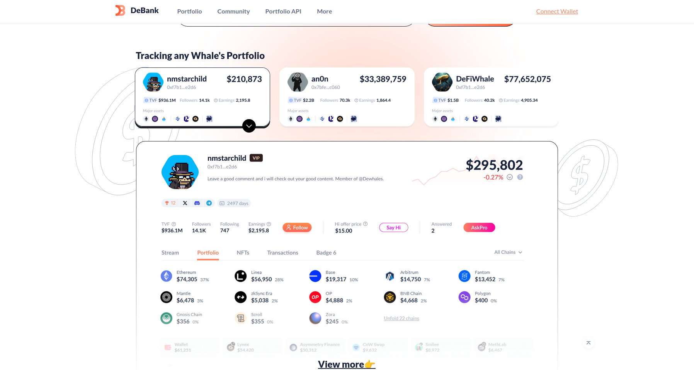
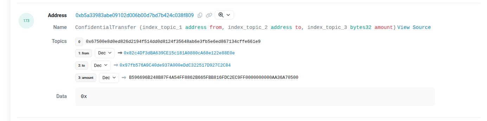
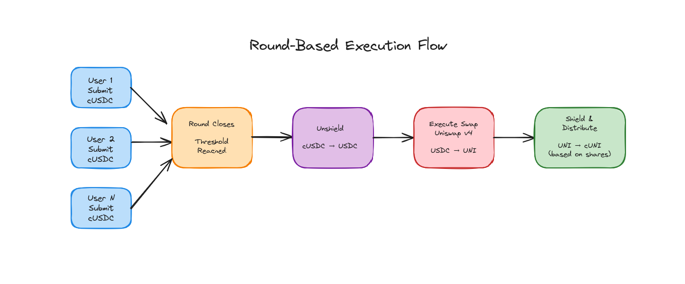

# Cipher Lend

**The confidential DeFi layer that lets users interact with existing protocols without exposing their positions on-chain**

Built during HackMoney 2026

---

## The Problem 

Given your **wallet address**, anyone can see all **your holdings, positions, spending history, and every transaction amount**

---

## The Solution 

**Use confidential tokens to enable confidential transfers**

Leveraging **Fully Homomorphic Encryption (FHE)** to encrypt user balances and amounts

**We're not reinventing the wheel**

=> Brings privacy on top of existing battle-tested DeFi protocols like **Uniswap**

---

## How It Works: Round-Based Execution

**Result**: Only aggregate values visible on-chain → Individual positions remain private

**This model works for swaps, lending, and other DeFi operations**

---

## Demo

**Live on Sepolia Testnet**

### Try It Out
**Website**: [cipher-lend-five.vercel.app](https://cipher-lend-five.vercel.app)

